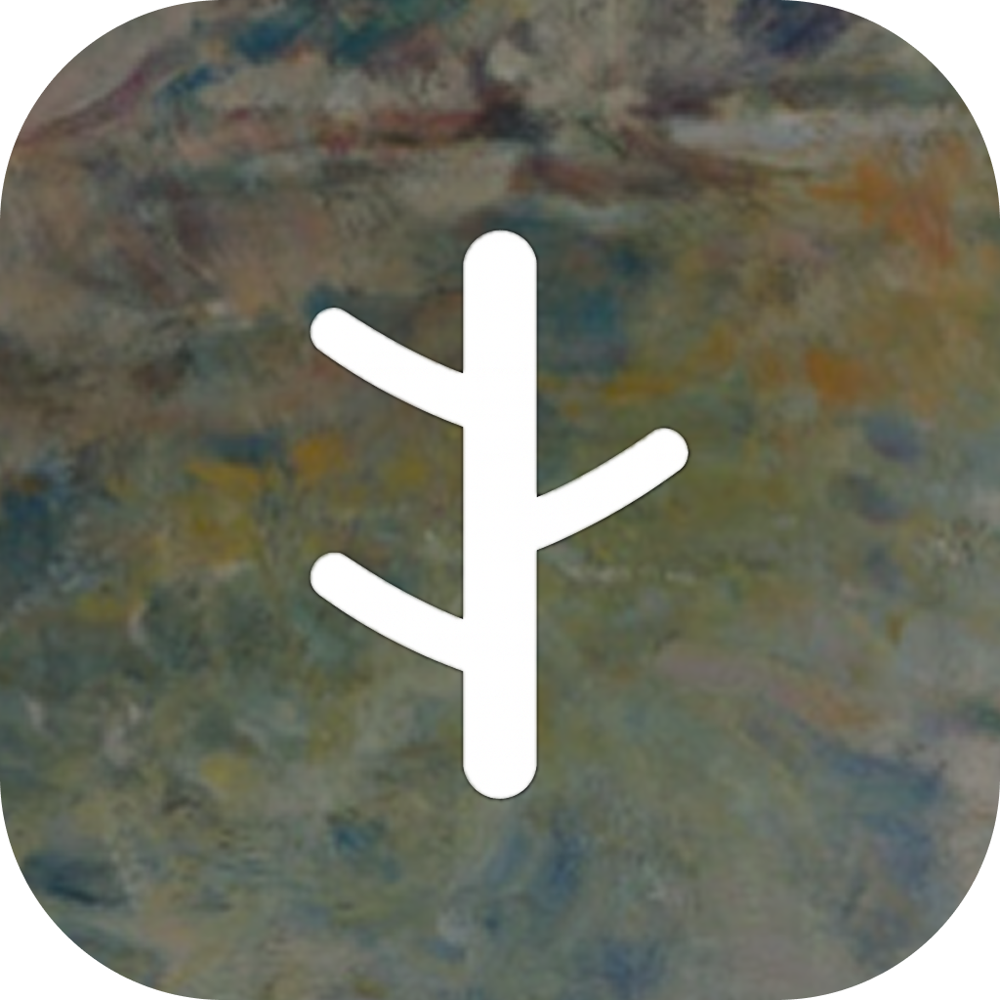
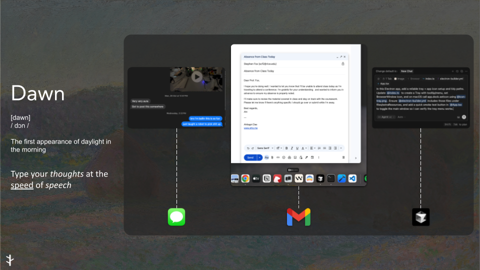

# dawn

  
  
Type at the Speed of Speech, Coming soon

Dawn is a STT app with Push-to-talk to normal conversations, Transcription Mode for longer conversations. It also lets you generate text such as emails or Cursor prompts given autio context and lets you edit text when selected. 

  

